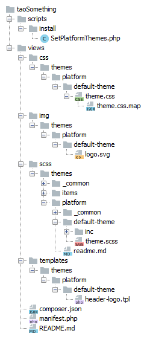

<!--
skip: true
-->
# Platform Themes

> How to set up platform themes. Predominately this article talks about a setup in a custom extension - in a multi tenancy environment this might be different.

## Definition

A platform theme is a set of stylesheets, templates, images etc. to modify the standard look and feel of the TAO platform, most often to apply a customer's branding. It for now is limited to header, footer, action bars and tabs. Although technically doable changes to the appearance of items are explicitely excluded. For all item related modifications item thems must be used.

## Basic Setup

On a customer platform themes are typically installed in a new extension. 

For this example we assume the extension is called _taoMyExtension_ and the theme _"My default theme"_.

- Copy the directory _*.scss_ from the Theme Toolkit to _/taoMyExtension/views_.
- Rename _/taoMyExtension/views/scss/themes/platform/default_ to _/taoMyExtension/views/scss/themes/platform/my-default-theme_.
- Create a path _/taoMyExtension/views/img/themes/platform/my-default-theme_.
- Create a path _/taoMyExtension/views/templates/themes/platform/my-default-theme_.
- Create a PHP class _/taoMyExtension/scripts/install/SetPlatformThemes.php_ and add a reference to the section _install/php_ in the manifest.
- Add a reference to your Theme Toolkit profiles, see the [Toolkit Readme](https://github.com/oat-sa/theme-toolkit/blob/master/README.md) for further information.
- Create your images and templates.
- Edit and compile your SCSS files.

The result should look about like this.



### The Configurable Platform Theme Class
This class can be used in two different ways, either by passing an array of options to the constructor or by calling `ConfigurablePlatformTheme::convertFromLegacyTheme`. An example for conversion is illustrated in the _Updater_ section below.

The array of options has two mandatory elements, `label` and `extensionId`. 

```php
$options = [
    'label' => 'Default Theme',
    'extensionId' => 'taoSomething'
];
$theme = new \oat\tao\model\theme\ConfigurablePlatformTheme($options);
```

This will generate a set of default values which are
```php
$options = [
    'logoUrl' => 'http://domain/taoMyExtension/views/img/themes/platform/my-default-theme/logo.png',
    'label' => 'My Default Theme',
    'extensionId' => 'taoMyExtension',
    'stylesheet' => 'http://domain/taoMyExtension/views/css/themes/platform/my-default-theme/theme.css',
    'id' => 'taoMyExtensionMyDefaultTheme'
];
```
Your configuration array will be merged over these defaults, so that you can easily overwrite whatever you wish. You can also add custom keys, there is a generic getter function to retrieve these values from the object. Mind you that keys must be in _camelCase_.

```php
$options = [
	...
    'myCustomKey' => 42
];

// can be retrieved with
$theme->getMyCustomKey();

```

A fully blown custom configuration example
```php
$config = [
    'label' => 'Default Theme',
    'extensionId' => 'taoMyExtension',
    'logoUrl' => 'http://example.com/foo.png',
    'link' => 'http://example.com',
    'message' => 'Tao Platform',
    'stylesheet' => 'http://example.com/tao/views/css/tao-3.css',
    'templates' => [
         'header-logo' => Template::getTemplate('blocks/header-logo.tpl', 'some-extension'),
         // if the value of the template === ConfigurablePlatformTheme::TEMPLATE_DEFAULT
         // the default theme path will be used something like:
         // templates/themes/platform/my-default-theme/login-message.tpl
         'login-message' => ConfigurablePlatformTheme::TEMPLATE_DEFAULT,
    ],
    // array of translatable strings
    'allTexts' => [
         'diagBrowserCheckResult' => __('Your browser %CURRENT_BROWSER% is not compatible.'),
         'diagOsCheckResult'      => __('Your Operating System %CURRENT_OS% is not compatible.')
    ],
    'whateverCustomStuff' => 'anything as long as the key is in camelCase'
];
```

### The Installer Class

This should be a pretty good starting point for your installer.
```php
namespace oat\taoCa\scripts\install;

use oat\oatbox\extension\InstallAction;
use oat\tao\model\theme\ThemeService;
use oat\tao\model\theme\ConfigurablePlatformTheme;
use oat\oatbox\log\LoggerAwareTrait;

class SetPlatformThemes extends InstallAction
{
    use LoggerAwareTrait;


    public function __invoke($params=array())
    {
        $themeService = $this->getServiceManager()->get(ThemeService::SERVICE_ID);

        $extensionId = 'taoMyExtension';
        $themes = [
            'my-default-theme' => 'My Default Theme'
        ];

        $defaultTheme = 'my-default-theme';

        // mind you that $key != theme id, this will rather be something like
        // taoExtensionMyFavoriteTheme
        foreach($themes as $key => $label) {
            call_user_func_array(
                [$themeService, $key === $defaultTheme ? 'setTheme' : 'addTheme'],
                [
                    new ConfigurablePlatformTheme([
                        ConfigurablePlatformTheme::LABEL => $label,
                        ConfigurablePlatformTheme::EXTENSION_ID => $extensionId,
                        ConfigurablePlatformTheme::TEMPLATES => [
                            'header-logo' => ConfigurablePlatformTheme::TEMPLATE_DEFAULT,
                        ]
                    ]),
                    false
                ]
            );
            $this->registerService(ThemeService::SERVICE_ID, $themeService);
        }

        $this->logInfo('Installed platform themes: ' . implode(',', array_keys($themes)));
        $this->logInfo('Platform theme default set to  ' . $defaultTheme);

        return true;
    }
}
```
After installing the theme its configuration will be available at _/config/tao/theming.conf.php_.

### The updater class

If you are using an extension you may have existing themes that can be in a legacy format. If you wish to convert them to instances of `ConfigurablePlatformTheme` you can use the following code.
```php
namespace oat\taoPremium\scripts\update;

use oat\oatbox\log\LoggerAwareTrait;
use oat\tao\model\theme\ThemeService;
use oat\tao\model\theme\ConfigurablePlatformTheme;

class Updater extends \common_ext_ExtensionUpdater
{

    use LoggerAwareTrait;

    public function update($initialVersion)
    {
        if($this->isVersion('0.2.0')){
            $serviceManager = $this->getServiceManager();
            $themeService = $serviceManager->get(ThemeService::SERVICE_ID);
            $themes = $themeService->getAllThemes();

            $oldDefault = $themeService->getThemeId();
            $newDefault = '';
            $i = 0;

            foreach($themes as $registryKey => $theme) {
                $newTheme = ConfigurablePlatformTheme::convertFromLegacyTheme($theme);
                $themeService->removeThemeById($registryKey);
                $themeService->addTheme($newTheme, false); 
                if($registryKey === $oldDefault) {
                    $newDefault = $newTheme->getId();
                }
                // if for some reasons no default can be found we fall back to the most recent theme
                if($i === count($themes) -1) {
                    $themeService->setCurrentTheme($newDefault ? $newDefault : $newTheme->getId());
                }
                $i++;
            }

            $serviceManager->register(ThemeService::SERVICE_ID, $themeService);

            $this->logInfo('Converted platform themes to instances of ConfigurablePlatformTheme');
            $this->logInfo('Removed duplicate themes');
            $this->logInfo('The new default theme is ' . $newDefault);

            $this->setVersion('0.3.0');
        }
    }
}
```
*Warning* Above code also removes multiple instances of the same class. If you don't want this to happen don't use the `$themeService->removeThemeById` part. You will then have duplicates that you will need to remove outside of the loop.

### Theme Toolkit profile
```json
"my-theme-platform": {
    "src": "../myProject/taoMyExtension/views/scss/themes/platform",
    "dest": "../myProject/taoMyExtension/views/css/themes/platform"
},
```


### Templates
The theme object is available in the templates and all public getters can be used. 
```php
getLogoUrl()?>" alt="Logo" id="tao-main-logo">
```

### SCSS Code
There are two directories called /_common/, the one on the top level contains code that is shared between item and platform themes. The second one is in the platform directory and contains code that is shared between all your platform themes. There is possibly a third one in items which is irrelevant for this article. If you plan to create just one theme or multiple very similar themes you should work in the _/platform/_common_ directory, otherwise in _/platform/my-theme_.

Fire up the the Toolkit compiler. The best starting point for platform themes is _platform/_common/inc/colors/_base.scss. Changes the colors to ones from the new color scheme, the compiler should then do most of the work for you.
