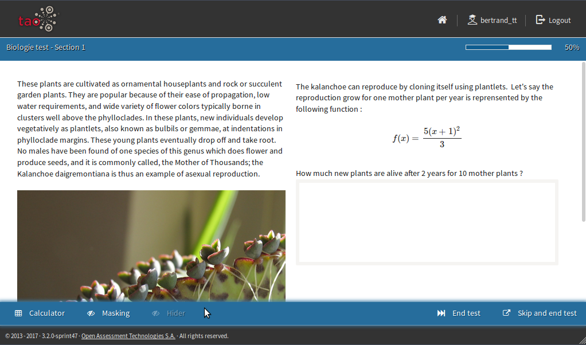
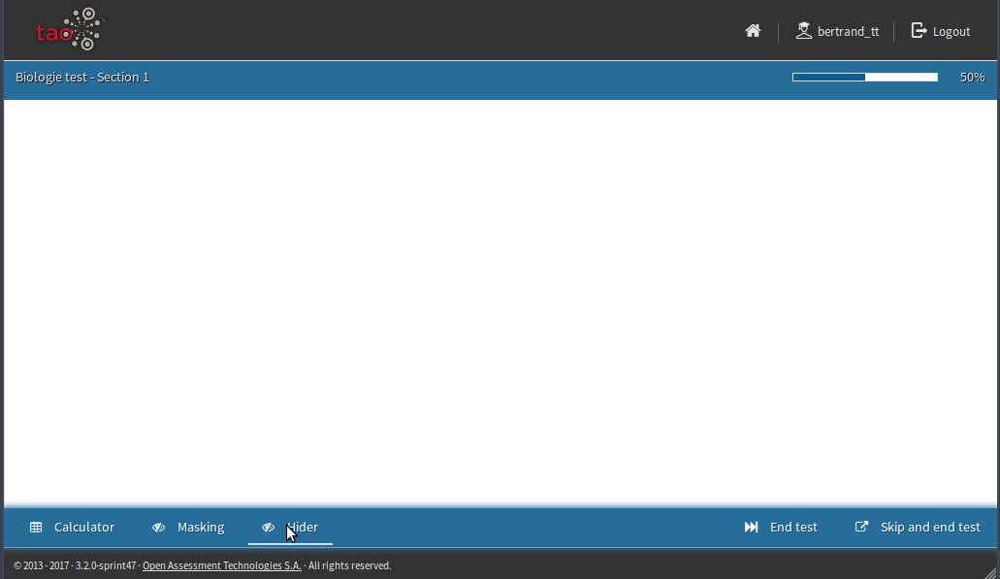

<!--
parent: 'Developer Guide'
toc: true
skip : true
authors:
    - 'Bertrand Chevrier'
tags:
    - 'Frontend'
    - 'Plugin'
    - 'JavaScript'
    - 'Test Runner'
-->
Enhance the user experience with Test Plugins
=============================================

One of the best option to improve, customize the test taker experience is using _Test Runner Plugins_.
A plugin can be anything that hook the test experience : some tools to help the test taker like a calculator, progress information, etc.

The user interface and the user experience of the test runner are made of plugins. Everything you see is a plugin :


In this tutorial we will lead you through the creation of a plugin, that hides the item when you click on a button, to prevent cheating (the neighbor who takes a look at your screen...).

## Set up

First ensure you have set up the new test runner in TAO

```
sudo -u www-data php index.php 'oat\taoQtiTest\scripts\install\SetNewTestRunner'
```

## The plugin base

We will add the given plugin to the `taoQtiTest` extension, but the plugin can be added to any extension.

### The JavaScript plugin

Create the following file at `views/js/runner/plugins/tools/hider/hider.js` using the following boilerplate :

```js
define([
    'taoTests/runner/plugin'
], function (pluginFactory){
    'use strict';

    return pluginFactory({

        name: 'hider',

        init : function init(){
        },

        render : function render(){
        },

        destroy : function destroy(){
        },

        enable : function enable(){
        },

        disable : function disable(){
        },

        show : function show(){
        },

        hide : function hide(){
        }
    });
});
```

Each of the plugin method will be called by the test runner during the according step, `init` is called when the runner is initializing, `render` when the DOM is rendered, etc.

The next step is to add a button to the toolbar. Plugins, interact with the GUI using the `areaBroker`. The `areaBorker` let's you access areas of the GUI and provides you also some built-in API, like the toolbar.

So in the `init` method of the plugin , we can create our button :

```js
init : function init(){
    this.button = this.getAreaBroker().getToolbox().createEntry({
        control : 'hider',
        text : 'Hider',
        title : 'Hide the item',
        icon : 'eye-slash'
    });
}
```

  And the `areaBroker` let's you also have access to the item area, so we will hide/show the item area when clicking on this new button.

```js
init : function init(){
   var areaBroker = this.getAreaBroker();
    this.button =  areaBroker.getToolbox().createEntry({
        control : 'hider',
        text : 'Hider',
        title : 'Hide the item',
        icon : 'eye-slash'
    });
    this.button.on('click', function (e){
        e.preventDefault();
        areaBroker.getContentArea().toggle();
    });
}
```

Using the `areaBroker`, you can access the following areas  (each area is a jQuery element) :
 - the whole container :  `areaBroker.getContainer()`
- the content area (where the item is displayed) :  `areaBroker.getContentArea()`
- the tool bar (but we advise to use `areaBroker.getToolbox().createEntry` to add entries)   :  `areaBroker.getToolboxArea()`
- the navigation  area (where the progress bar is) :  `areaBroker.getNavigationArea()`
- the control  area (where the _next_ button is) :  `areaBroker.getControlArea()`
- the panel area  :  `areaBroker.getPanelArea()`,
- the header area (where the title is displayed) :   `areaBroker.getHeaderArea()`,

That's it for the moment. Before adding more features, we need to test our brand new plugin.

### Register the plugin

  Every plugin needs to be register and activated to be available in the test runner. To test, the plugin the registration can be done by editing the configuration file `config/taoTests/test_runner_plugin_registry.conf.php`  and adding a new entry for our plugin :

```php
'taoQtiTest/runner/plugins/tools/hider/hider' =>[
	'id' => 'hider',
	'module' => 'taoQtiTest/runner/plugins/tools/hider/hider',
	'bundle' => null,
	'position' => null,
	'name' => 'Hider',
	'description' => 'Hide the item',
	'category' => 'tools',
	'active' => true,
	'tags' => [ 'tools' ]
]
```

To make this configuration sustainable, we advise you to use a [dedicated set up script](https://github.com/oat-sa/extension-tao-testqti/blob/master/scripts/install/RegisterTestRunnerPlugins.php)


### Plugin lifecycle

The plugin's button should display in the test toolbar now :



But the button starts _disabled_, so we need to ensure the button is enabled when we need it. Plugins can listen the test runner events and behave accordingly. We will enable the button only when an item is loaded and disable it otherwise.

Still in the `init` method, we will listen for test runner events, and implement the `enable` and `disable` methods.

```js
define([
    'taoTests/runner/plugin'
], function(pluginFactory) {
    'use strict';

    /**
     * Returns the configured plugin
     */
    return pluginFactory({

        name: 'hider',

        init: function init() {
            var self  = this;
            var areaBroker = this.getAreaBroker();

            this.button = areaBroker.getToolbox().createEntry({
                control: 'hider',
                text: 'Hider',
                title: 'Hide the item',
                icon: 'eye-slash'
            });
            this.button.on('click', function(e) {
                e.preventDefault();
                areaBroker.getContentArea().toggle();
            });

            this.getTestRunner()
                .on('enabletools renderitem', function (){
                    self.enable();
                })
                .on('disabletools unloaditem', function (){
                    self.disable();
                });
        },

        render: function render() {},

        destroy: function destroy() {},

        enable: function enable() {
            this.button.enable();
        },

        disable: function disable() {
            this.button.disable();
        },

        show: function show() {},

        hide: function hide() {}
    });
});
```
We have implemented the `enable` and `disable` method, retrieved the current test runner instance using `this.getTestRunner()` and listen some events triggered by the test runner :
 - `renderitem` when an item is rendered to the test taker
 - `unloaditem` when an item is removed from the screen
 - `enabletools` and `disabletools` are used to control whether all tools should be available, for example, when displaying a modal popup the tools should be _disabled_.

 The test runner provides much more useful events for the plugins, like
 - `loaditem` when the item data is retrieved (but the item isn't yet displayed)
 - `move`  or `skip` , so you know when the test taker move forward, or backward.
 - `exit` or  `timeout` also pretty useful

The complete list of events is available in the [test runner documentation](https://hub.taocloud.org/techdocs/tao-testqti/test-runner#events).

For your information, since we can retrieve an instance of the test runner, we have access to the test and item data and metadata, by using the methods  :
 - `this.getTestRunner().getTestData()`
 - `this.getTestRunner().getTestContext()`
 - `this.getTestRunner().getTestMap()`
 - `this.getTestRunner().getItem()`


Let's try now, we have a functional plugin !




### Keep the room clean

But before leaving, since we are conscientious people, we need to handle the plugin destroy correctly by removing event handlers :

        destroy: function destroy() {},
