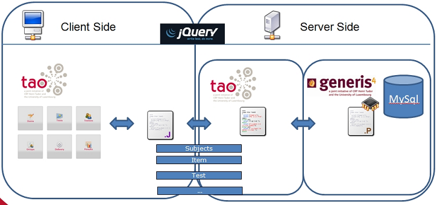
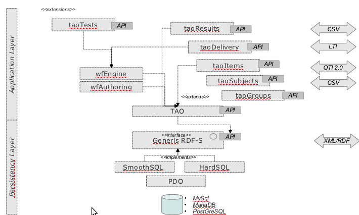

{{\>toc}}

TAO Architecture
================

From a global perspective, the TAO architecture does not fundamentally differ from those used in many PHP-based applications. However, the main components of the TAO global architecture (database, application layer, user interfaces) have their specifics. This page unveils many details of the architecture of each component.

On the server side, a database management system stores data - this function is achieved by the Generis platform through the use of dedicated API. This layer is called *Persistence Layer*. On top of this first layer, an *Application Layer* written in PHP implements all the functions specific to eTesting. This Application Layer complies with the Model-View-Controller framework and thus, it builds the views that are delivered to the web browser on the client side. On the client side, Javascript scripts interact with the Application Layer (located on the server side), update the views if needed (or request new ones from the server), and generally operate the client-side business logic (e.g. simple validation of input data). The communication between client- and server-side relies on AJAX mechanism; thus, by reducing the need for complete page reload, it clearly adds comfort in the user’s experience. The jQuery library is used to ease this ajax-based communication.

\
\

TAO Persistence Layer
=====================

The *Persistence Layer* of TAO relies on Generis. This differs from classical applications as it gives users the opportunity to manage their models of resources (e.g., the definition of subjects, the items model, etc.) on their own - i.e., outside the constraints of predefined structures (usually attached to specific database schema - relatively rigid once they are filled with data). This means that users may unilaterally define what the relevant pieces of information are, and how they should be structured in order to, for example, manage their subjects. For instance, in the context of human resource management, they could define any characteristics pertaining to their employees expected to take a test like their background information, their department, their function, etc. Elsewhere, in the domain of education those characteristics are not relevant. In the context of education, users would rather manage students and what classrooms they belong to, their teachers, and so on.

In short, thanks to Generis, users experience a larger degree of freedom at the level of the definition (and management) of the models they create in opposition to classical persistence layer where the model is hard-coded (usually by developers) and not subject to easy structural evolution - especially when it has already been used.

Generis architecture is described here: [[Generis\_Overview]].

TAO Application Layer
=====================

The TAO *Application Layer* is split into extensions. Each extension manages a specific subset of functions pertaining to a sub-domain of the eTesting. One can cite, for example, the TAO *Subject* extension, the *Group* extension and also the general *TAO extension* that implements generic functions generally required for eTesting (e.g. login/logout, user management, language management, resource management).

This picture illustrates the different extensions built for TAO and how TAO depends on Generis for knowledge/database management.

More detailed information about extensions’ architecture can be found here: [[Framework-Extensions]]

TAO Client Side
===============

For both back-office operations and for test-taker operations, the TAO client side is written in XHTML, Javascript and CSS.

[[Views]]

User interfaces give access to all TAO features.

TAO WorkFlow Engine
===================

An extra layer on top of TAO allows the definition of restricted user interfaces giving access to some particular features of the TAO platform based on roles of user connected. This is the purpose of the workflow engine described here:

The complete application layer of TAO has been split into autonomous services that the user can access independently (Preview of an item, authoring tool, translation tool, etc.). An extension of TAO called “Process” allows assessment responsible to design organizational processes where users are assigned some specific activities and some particular tools expected to be used. This extension of TAO is then able to drive this process and gives the right tool to the right TAO user at the right time. For instance, this allows to standardize the way test items can be created or item translation can be performed.\

The quality Layer is made of a Services/widgets directory, the workflow engine presenting the services to the right connected user and a process designer tool. More information about the workflow engine can be found here: [[Workflow\_Engine]]

