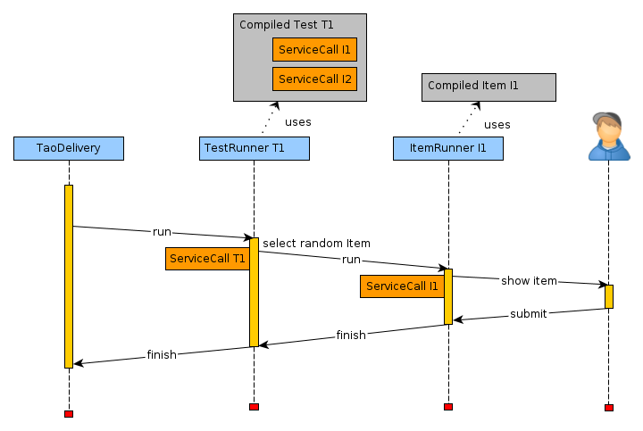

<!--
parent: Tutorials
created_at: '2013-10-31 14:21:17'
updated_at: '2013-11-20 11:29:02'
authors:
    - 'Joel Bout'
tags:
    - Tutorials
-->

How to implement a custom test model
====================================

This how-to tries explain how to create your own test model based upon an example

Requirements
------------

For this tutorial you will need:

-   a working Tao 2.5 instalation

You should already be familar with:

-   How to create an extension ([Make a new extension](../tutorials/make-a-new-extension.md))
-   Resource Description Framework ([RDF](../generis-overview/rdf.md))
-   Tao 2.5 Delivery model

The components
--------------

### Extension

The following three files are required for any extension:

-   **manifest.php** describes the extension and is required in order to be able to install it. (see [ExtensionManifestDescription](../framework-extensions/extensionmanifestdescription.md))
-   **.htaccess** uses mod_rewrite to redirects requests to index.php
-   **index.php** runs the Bootstrap and initialises the system for every request.

### Test model

A test model is a class implementing the interface *taoTests_models_classes_TestModel*. See Testmodel 2.5

-   ./models/classes/ **class.TestModel.php** contains the class that represents our new test model.
-   ./models/ontology/ **testModel.rdf** registers the class randomTest_models_classes_TestModel into Tao.

These allow us to create a test with this model.

### Test runner

In order to be able to execute our test, we need to implement a test runner.

-   ./actions/ **class.TestRunner.php** contains the controller which is called by the test taker to run the test.
-   ./models/ontology/ **testRunner.rdf** describes the service which is made up by the called action and the required parameters.
-   ./includes/ **constants.php** assigns constants to the service and the parameter for a cleaner code.
-   ./views/templates/ **testrunner.tpl** contains the view of the test-runner

### Compilation

To prepare the items in a way that the test runner can execute them, we have to compile them first

-   ./models/classes/ **class.TestCompiler.php** is the compiler which compiles the items available and stores the references to them in a file

Explications
------------

This is one of the simplest test models that can be implemented:

During the execution of a random test one item will be chosen by random from the pool of available items (at the time of compilation) 

and after the test-taker has responded to this item the test will terminate.

### Test compilation

The compilation of a delivery is comparable to a depth-first search. In order to be able to compile a delivery the tests contained within have\
to be compiled. In order to compile the tests, their containing items have to be compiled first.

So during compilation we iterate over the available items and compile them. The item compiler will return a service call, which consists of\
the runner associated with the item model and the parameter that allows the item runner to access the resources of this specific item. By serializing these\
service calls we can create the following structure:

    array(
        0 => array(
            'label' => 'Planets and moons',
            'runtime' => 'O:38:"tao_models_classes_service_ServiceCall":3:{s:57:...........ameter";N;}'
        ),
        1 => array(
             'label' => 'Elections in the United States, 2004',
             'runtime' => 'O:38:"tao_models_classes_service_Servic..........ameter";N;}'
        ),
        1 => array(
             'label' => '.....
        ....
    )

We have one entry per item with:

-   ‘runtime’ the php serialized ServiceCall object, that we can unserialize during runtime
-   ‘label’ stores the value of the property label during compilation. This is currently unused in the runner, 

    but we could store several other properties values that could influence the item choice in the test-runner.

After storing this structure into a .php file that we create in the provided directory, we create a service call to the our test-runner service and pass the newly created file as a parameter.

This service call is then stored in the compiled delivery and will be called during the execution of this delivery

### Test runner implementation

Because in Tao the items as well as the deliveries can have several different implementation the test runner must be independent from\
these. The interface between the item runner and the delivery runner are service calls.

The execution of a delivery containing our random test would run through the following steps:

1.  The test-taker clicks on “Take Test”, and a new delivery execution for the selected delivery is created
2.  Assuming a simple delivery, there is only one test and this test runner service is called
3.  The test runner selects a random item from the data it prepared during compilation
4.  The test runner calls the item runner of the selected item
5.  The item runner displays the item indicated by the parameters on the screen, using the resources the item model prepared during compilation
6.  Once the test-taker finished the item, the item runner informs the test runner
7.  The test runner (consisting of a single item) then immediately informs the delivery that he test (and with it the delivery) has finished
8.  The test-taker gets redirected to the delivery home screen

Next steps
----------

### Authoring

Most test models will require an authoring to select which items should be included and advanced options concerning the execution.

### Test session

Since most models will contain more than a single item it will be required to keep track of the current test session. Information related\
to current item, already passed items, elapsed time and so on needs to be stored in order to track the users progress and allow test session\
to be interrupted and resumed.

